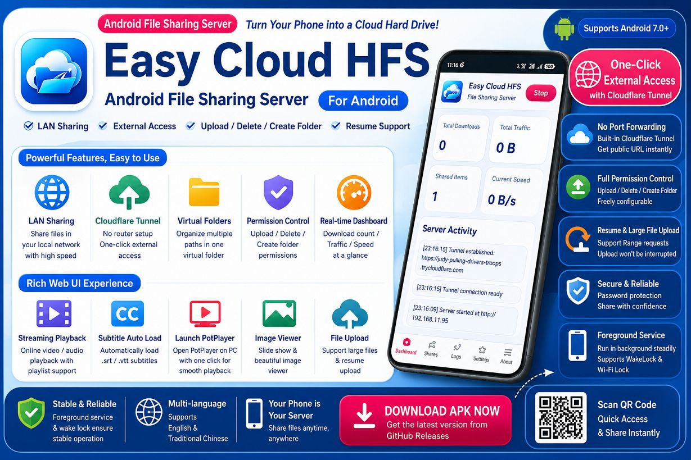
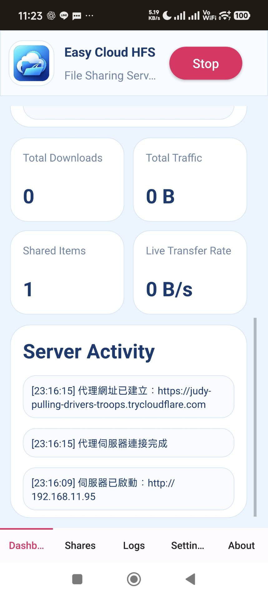
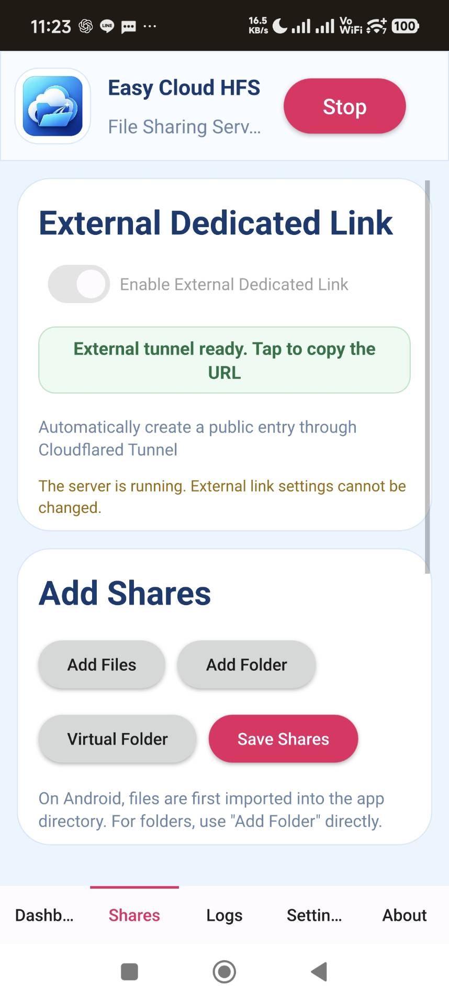
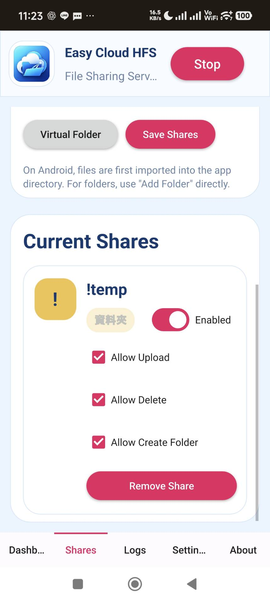
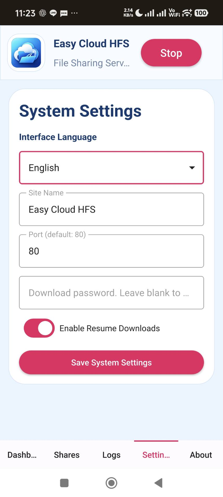
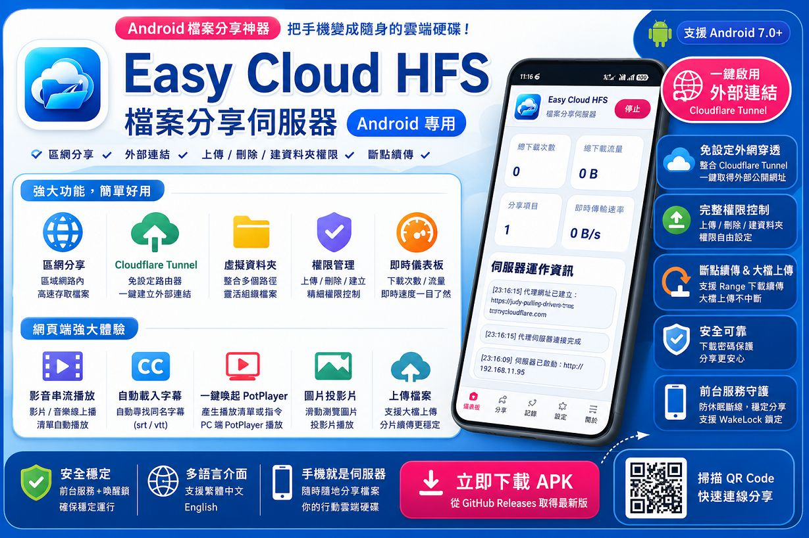
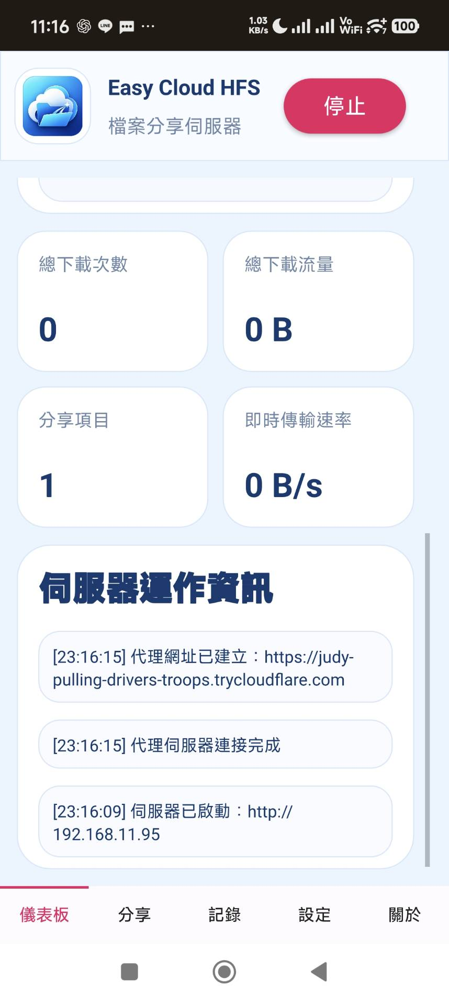
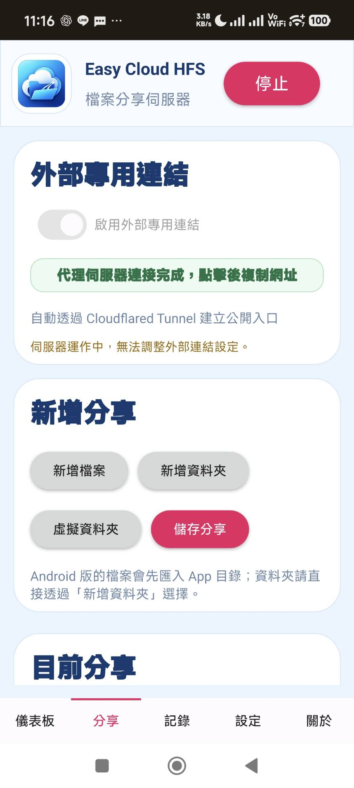
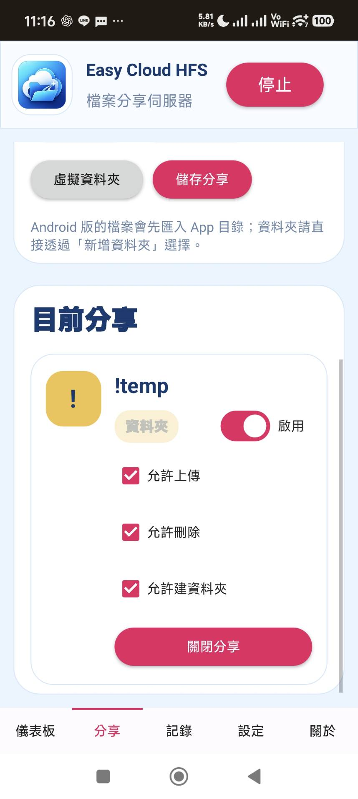
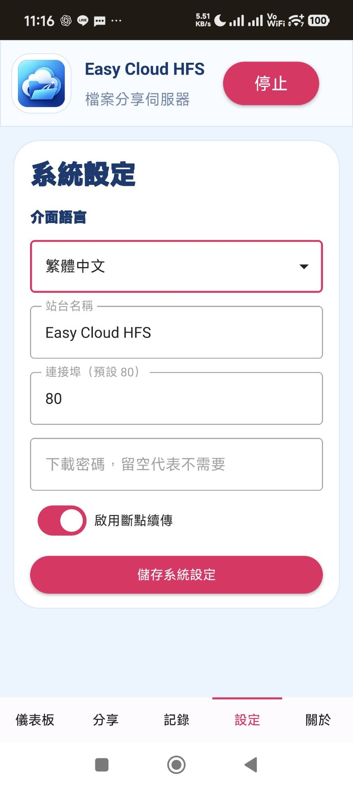

# Easy Cloud HFS Android

Lightweight Android file sharing server inspired by HFS.


[Releases](https://github.com/Terence0816/easy-cloud-hfs-android/releases)

English | [繁體中文](#繁體中文)



Easy Cloud HFS Android is a lightweight **Android file sharing server**.

It turns your Android phone or tablet into a simple HTTP file server, allowing other devices to access shared files through a web browser. It supports fast local network sharing and can also create a temporary public access URL through Cloudflare Tunnel.

This repository is used for official APK releases, screenshots, documentation, and update notes.

> The Android source code is not currently published.

## Features

* Android file sharing server
* Local network file sharing
* Optional Cloudflare Tunnel external access
* Automatically generates a temporary `trycloudflare.com` public URL
* Share files and folders through a browser
* Virtual folder support
* Upload permission control
* Delete permission control
* Create-folder permission control
* Download password support
* HTTP Range request support for resume and media seeking
* Large-file upload support
* Web-based file manager
* Online video and audio playback
* Subtitle auto-load support
* PotPlayer launch support for Windows clients
* Image preview and slideshow support
* Real-time dashboard
* Server activity log
* Foreground service mode for stable background operation
* WakeLock and Wi-Fi lock support
* Traditional Chinese and English interface
* Mobile-friendly user interface

## Main Use Cases

* Share files from an Android phone to computers on the same LAN
* Use an Android phone as a small temporary file server
* Share files with friends or customers through a browser
* Transfer files without installing a client program on the receiving device
* Create a temporary external public link with Cloudflare Tunnel
* Stream videos or music directly from the Android device
* Use a phone or tablet as a lightweight portable cloud disk

## How It Works

1. Start the server on your Android device.
2. Add files, folders, or virtual folders to share.
3. Open the LAN address from another device in a browser.
4. Optional: enable Cloudflare Tunnel to create an external public URL.
5. Use upload, delete, and create-folder permissions depending on your needs.

## Interface Overview

### Dashboard

The dashboard shows basic server status and real-time statistics.



It can display:

* Total download count
* Total transferred data
* Shared item count
* Current transfer speed
* Server activity messages
* LAN address
* Cloudflare Tunnel connection status

### Share Management

The share page lets you add files, add folders, create virtual folders, and manage existing shared items.



Each shared item can be controlled individually.



Supported permissions include:

* Enable / disable share
* Allow upload
* Allow delete
* Allow create folder

### Settings

The settings page allows you to change the interface language, server name, port, download password, and resume support.



Available settings include:

* Interface language
* Site name
* Server port
* Download password
* Resume / breakpoint transfer option

## Web Interface

Clients can access shared files through a browser.

### Multi-file Selection


### Image Preview


### MP4 / Video Player


The web interface is designed for simple access, file browsing, file download, media preview, and browser-based upload when permissions are enabled.

## Cloudflare Tunnel

Easy Cloud HFS Android can use Cloudflare Tunnel to create a temporary public access URL.

This allows external access without:

* Public IP
* Router port forwarding
* DDNS setup
* Firewall changes

When the tunnel is connected, the app shows the generated public URL.

> Cloudflare Tunnel public URLs are temporary and may change after restarting the server or tunnel.

## Media Streaming

The browser interface supports online media playback.

Supported features include:

* HTML5 video playback
* HTML5 audio playback
* Playlist-style browsing
* HTTP Range request support
* Video seeking
* Subtitle auto-load for matching subtitle files
* PotPlayer launch support for Windows clients
* Image preview and slideshow-style browsing

## Permissions and Security

Each shared item can have its own permissions.

You can decide whether users are allowed to:

* Upload files
* Delete files
* Create folders

The app also supports a download password to reduce unauthorized access.

> If you enable external access, please only share the URL with people you trust.

## Download

Download the latest APK from the GitHub Releases page:

[Easy Cloud HFS Android Releases](https://github.com/Terence0816/easy-cloud-hfs-android/releases)

Release assets usually include:

```text
EasyCloudHFSAndroid.apk
EasyCloudHFSAndroid.apk.sha256.txt
```

## SHA-256

```text
6c8fa447f6073c890ed21c0e50ef828968cc867e95f6fdffa4dffe0eea0f1fb1  EasyCloudHFSAndroid.apk
```

## Installation Notes

* This is an Android APK release.
* Android may show a warning when installing APK files downloaded outside Google Play.
* Please install only from the official GitHub Releases page.
* Some Android devices may require battery optimization to be disabled for more stable background sharing.
* For long-running sharing, keeping the app in foreground service mode is recommended.
* The Android source code is not currently published.

## Search Keywords

Android file sharing server, Android HFS, HTTP file server, Android cloud file server, LAN file sharing, Cloudflare Tunnel Android, trycloudflare file sharing, Android web file manager, Android file upload server, Android media streaming server, PotPlayer streaming, Android QR file sharing, Android virtual folder sharing

## Disclaimer

This software is provided as-is.

The author does not guarantee full compatibility with every Android device, network environment, browser, or media player.

Please use this tool only for files you own or have permission to share.

---

# 繁體中文



Easy Cloud HFS Android 是一套輕量化的 **Android 檔案分享伺服器**。

它可以將 Android 手機或平板變成簡易 HTTP 檔案伺服器，讓其他裝置透過瀏覽器存取分享檔案。除了區域網路分享外，也可以透過 Cloudflare Tunnel 建立臨時外部公開連結，方便遠端存取。

此儲存庫主要用於官方 APK 發行、截圖、說明文件與更新紀錄。

> Android 版目前不公開原始碼。

## 功能特色

* Android 檔案分享伺服器
* 區域網路檔案分享
* 可選擇啟用 Cloudflare Tunnel 外部連結
* 自動產生臨時 `trycloudflare.com` 公開網址
* 可透過瀏覽器存取分享檔案與資料夾
* 支援虛擬資料夾
* 可控制是否允許上傳
* 可控制是否允許刪除
* 可控制是否允許建立資料夾
* 支援下載密碼
* 支援 HTTP Range Request，方便續傳與影音拖曳播放
* 支援大檔案上傳
* 內建網頁端檔案管理介面
* 支援線上影片與音樂播放
* 支援字幕自動載入
* 支援 Windows 端 PotPlayer 喚起播放
* 支援圖片預覽與投影片瀏覽
* 即時儀表板
* 伺服器運作記錄
* 前台服務模式，提高背景運行穩定度
* WakeLock 與 Wi-Fi Lock 支援
* 支援繁體中文與 English 介面
* 手機友善操作介面

## 適用情境

* 從 Android 手機分享檔案給同一個區域網路內的電腦
* 將 Android 手機當成臨時小型檔案伺服器
* 透過瀏覽器分享檔案給朋友或客戶
* 接收端不需要安裝任何客戶端程式
* 透過 Cloudflare Tunnel 建立臨時外部公開連結
* 直接從 Android 裝置串流影片或音樂
* 將手機或平板當成輕量化隨身雲端硬碟

## 使用方式

1. 在 Android 裝置上啟動伺服器。
2. 新增要分享的檔案、資料夾或虛擬資料夾。
3. 從其他裝置的瀏覽器開啟區域網路網址。
4. 視需要啟用 Cloudflare Tunnel 建立外部公開網址。
5. 依需求設定上傳、刪除、建立資料夾等權限。

## 介面介紹

### 儀表板

儀表板會顯示基本伺服器狀態與即時統計資料。



可顯示：

* 總下載次數
* 總下載流量
* 分享項目數量
* 即時傳輸速度
* 伺服器運作資訊
* 區域網路網址
* Cloudflare Tunnel 連線狀態

### 分享管理

分享頁面可新增檔案、新增資料夾、建立虛擬資料夾，並管理目前分享項目。



每個分享項目都可以個別控制權限。



支援權限：

* 啟用 / 停用分享
* 允許上傳
* 允許刪除
* 允許建立資料夾

### 系統設定

設定頁面可調整介面語言、站台名稱、連接埠、下載密碼與斷點續傳設定。



可設定項目包含：

* 介面語言
* 站台名稱
* 伺服器連接埠
* 下載密碼
* 斷點續傳選項

## 網頁端介面

使用者可透過瀏覽器存取分享檔案。

### 多選檔案


### 圖片預覽


### MP4 / 影片播放器


網頁端介面設計用於快速存取、瀏覽檔案、下載檔案、預覽媒體，以及在權限允許時透過瀏覽器上傳檔案。

## Cloudflare Tunnel 外部連結

Easy Cloud HFS Android 可透過 Cloudflare Tunnel 建立臨時外部公開網址。

不需要：

* 公網 IP
* 路由器 Port Forwarding
* DDNS 設定
* 防火牆調整

當 Tunnel 連線完成後，App 會顯示產生的公開網址。

> Cloudflare Tunnel 公開網址是臨時網址，重新啟動伺服器或 Tunnel 後可能會變更。

## 影音串流

網頁端支援線上影音播放。

支援功能包含：

* HTML5 影片播放
* HTML5 音訊播放
* 類播放清單瀏覽
* HTTP Range Request
* 影片拖曳播放
* 自動載入同名字幕檔
* Windows 端 PotPlayer 喚起播放
* 圖片預覽與投影片瀏覽

## 權限與安全

每個分享項目都可以個別設定權限。

可自行決定是否允許使用者：

* 上傳檔案
* 刪除檔案
* 建立資料夾

本 App 也支援下載密碼，降低未授權存取風險。

> 若啟用外部連結，請只將網址提供給可信任的對象。

## 下載

請至 GitHub Releases 頁面下載最新 APK：

[Easy Cloud HFS Android Releases](https://github.com/Terence0816/easy-cloud-hfs-android/releases)

Release assets 通常包含：

```text
EasyCloudHFSAndroid.apk
EasyCloudHFSAndroid.apk.sha256.txt
```

## SHA-256

```text
6c8fa447f6073c890ed21c0e50ef828968cc867e95f6fdffa4dffe0eea0f1fb1  EasyCloudHFSAndroid.apk
```

## 安裝注意事項

* 這是 Android APK 發行版本。
* 從 Google Play 以外來源安裝 APK 時，Android 可能會顯示安全提醒。
* 請只從官方 GitHub Releases 頁面下載。
* 部分 Android 手機若要長時間分享，建議關閉本 App 的電池最佳化限制。
* 若要長時間分享，建議使用前台服務模式。
* Android 版目前不公開原始碼。

## 搜尋關鍵字

Android 檔案分享伺服器、Android HFS、HTTP 檔案伺服器、Android 雲端檔案伺服器、區域網路檔案分享、Cloudflare Tunnel Android、trycloudflare 檔案分享、Android 網頁檔案管理、Android 檔案上傳伺服器、Android 影音串流伺服器、PotPlayer 串流、Android QR Code 分享、Android 虛擬資料夾分享

## 免責聲明

本工具依現況提供。

作者不保證所有 Android 裝置、網路環境、瀏覽器或播放器皆能完整相容。

請僅分享您擁有或被授權分享的檔案。
